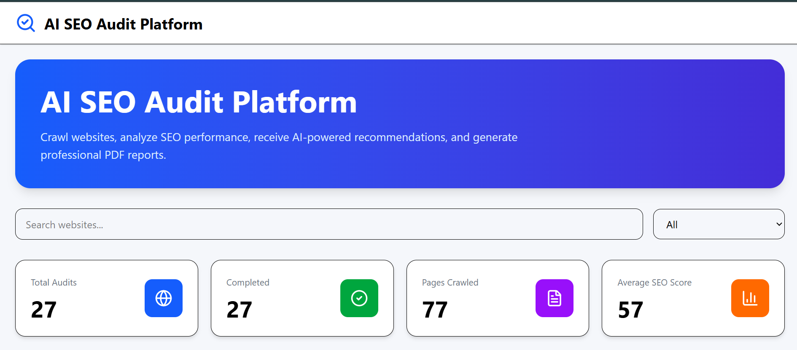
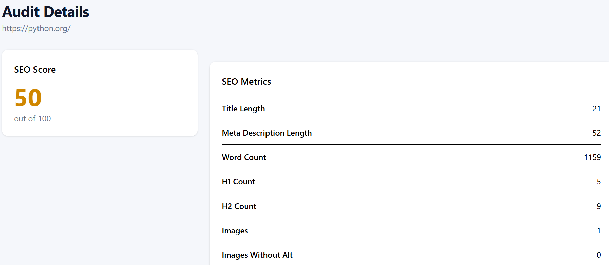
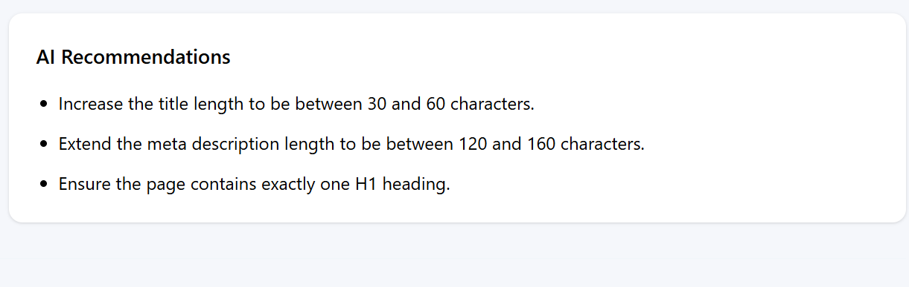
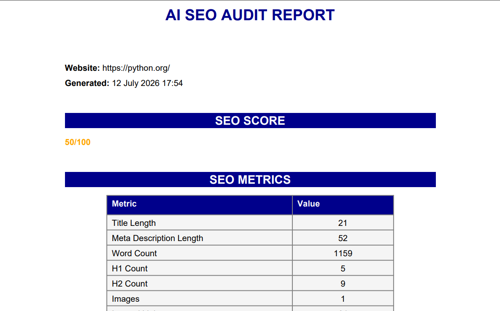
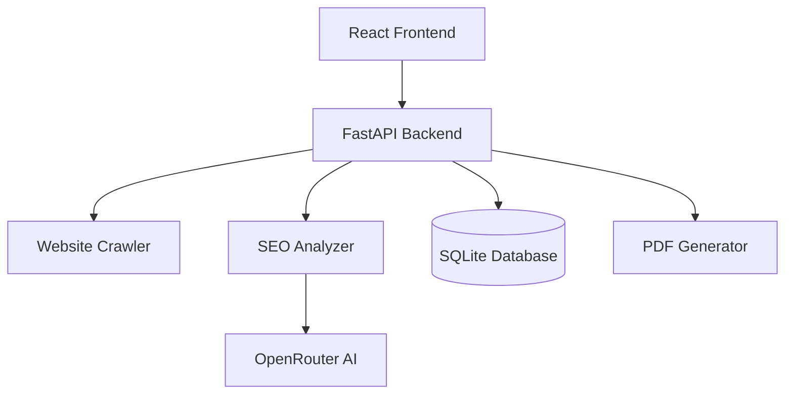

# 🚀 AI-Powered Website SEO Audit Platform


An AI-powered SEO auditing platform that crawls websites, performs comprehensive SEO analysis, generates AI-based optimization recommendations using OpenRouter LLMs, and exports professional PDF reports.

---

## 💡 Project Highlights

- **Layered Architecture:** Built using a clean separation of concerns (API → Services → Repositories → Database).
- **AI Integration:** Integrated OpenRouter LLMs for intelligent, context-aware SEO optimization recommendations.
- **Web Crawling:** Implemented robust website crawling utilities using `BeautifulSoup` and `Requests`.
- **Automated Reporting:** Generates professional, download-ready PDF reports programmatically using `ReportLab`.
- **Modern UI:** Features a highly responsive interactive dashboard built with React 19 and Tailwind CSS 4.
- **Containerized:** Fully Dockerized for seamless multi-environment setup and quick deployment.

---

## 📸 Screenshots

| Dashboard | Audit Details |
|-----------|---------------|
|  |  |

| AI Recommendations | PDF Report |
|-------------------|------------|
|  |  |

---

## 🎥 Demo & Workflow

### 📈 Dashboard
View all completed SEO audits at a glance along with their current status, historical timestamps, and computed SEO scores.

### 🔍 Audit Details
Inspect technical granular SEO metrics, document-structure analysis, and targeted AI-powered recommendations for each crawled page.

### 📄 PDF Export
Generate a client-ready, professional SEO audit report document in PDF format with a single click.

---

## 🌟 Key Features

- 🌐 **Website Crawling:** Deep crawling mechanics with configurable page limits.
- 📊 **Technical SEO Analysis:** Automated parsing and structural validation of web pages.
- 🤖 **AI Recommendation Engine:** Targeted optimizations powered by OpenRouter (DeepSeek Chat).
- 📄 **One-Click PDF Generation:** Instant generation of comprehensive performance reports.
- 📈 **SEO Score Calculation:** Dynamic weighting algorithm scoring performance from 0–100.
- 🗂 **Persistence Layer:** Persistent storage configuration using SQLite with SQLAlchemy ORM.
- 📝 **Production Logging:** Implemented structured system logging for easy debugging.

---

## 🛠 Tech Stack

### Backend
- **Framework:** FastAPI
- **Data Layer:** SQLAlchemy ORM, Pydantic
- **Document Utilities:** ReportLab
- **Scraping Pipeline:** Requests, BeautifulSoup
- **AI Integration:** OpenRouter API

### Frontend
- **Framework:** React 19, Vite
- **Styling:** Tailwind CSS 4
- **Networking:** Axios
- **Data Visualization:** Recharts

### Database & DevOps
- **Database:** SQLite
- **Containers:** Docker, Docker Compose

---

## 🏗 Project Architecture



---

## 📡 API Endpoints

| Method | Endpoint | Description |
|--------|----------|-------------|
| **POST** | `/audits/` | Start a new asynchronous website SEO audit |
| **GET** | `/audits/` | Retrieve a summary history of all audits |
| **GET** | `/audits/{id}` | Fetch granular technical details for a specific audit |
| **DELETE** | `/audits/{id}` | Safely delete an audit record from history |
| **GET** | `/audits/{id}/report` | Compile and download the generated PDF report |

---

## 📊 Core SEO Metrics Evaluated

The analysis engine evaluates and validates the following page-level criteria:

* **Title & Metadata:** Title length, meta description presence, and length validation (120–160 chars).
* **Content Structure:** Word counts, single `<h1>` tag validation, and `<h2>` heading hierarchy.
* **Asset Optimization:** Total image counts along with detailed detection of missing `alt` attributes.
* **Link Profile:** Granular calculation and separation of internal vs external reference links.
* **Compliance Checks:** Discovery and validation of canonical tags and document language attributes.

> 💡 **AI Core Logic:** Only failed technical checks trigger a payload to the OpenRouter LLM engine. This keeps token usage optimized while ensuring actionable advice is generated where it matters most.

---

## 📁 Folder Structure

```text
seo-audit-platform/
│
├── app/                  # FastAPI Application Core
│   ├── api/              # Route controllers & endpoints
│   ├── core/             # App configuration and security
│   ├── crawler/          # BeautifulSoup scraping logic
│   ├── database/         # Session setup & connection config
│   ├── models/           # SQLAlchemy database schemas
│   ├── repositories/     # Data access abstraction layers
│   ├── reports/          # ReportLab PDF design layouts
│   ├── response_schemas/ # Outgoing API serializers
│   ├── schemas/          # Inbound Pydantic validation rules
│   ├── services/         # Core business & AI orchestration logic
│   └── main.py           # Application bootstrap entry point
│
├── frontend/             # React Client Application
│   ├── src/
│   │   ├── components/   # Shared UI elements
│   │   ├── pages/        # Dashboard & view modules
│   │   ├── services/     # API networking layers
│   │   └── App.jsx
│
├── pyproject.toml        # UV package management lockfile
├── docker-compose.yml    # Orchestration config
└── README.md
```

---

## 🚀 Installation & Local Setup

### 1. Clone the Repository
```bash
git clone https://github.com
cd seo-audit-platform
```

### 2. Configure Environment Variables
Create a `.env` file inside the root directory:
```env
OPENROUTER_API_KEY=your_openrouter_api_key_here
OPENROUTER_MODEL=deepseek/deepseek-chat-v3
DATABASE_URL=sqlite:///seo_audit.db
MAX_AI_RECOMMENDATIONS=1
```

### 3. Start the Backend
The project uses `uv` for modern, blazing-fast Python package management.
```bash
# Install dependencies and sync virtual environment
uv sync

# Start the local development server
uvicorn app.main:app --reload
```
*Backend API Documentation loads at:* `http://127.0.0`

### 4. Start the Frontend
Open a new terminal window or tab:
```bash
cd frontend
npm install
npm run dev
```
*Frontend application serves locally at:* `http://localhost:5173`

---

## 🎯 Future Roadmap

- [ ] JWT-based Multi-user Authentication & Authorization
- [ ] Migrate database persistence layer to PostgreSQL
- [ ] Implement asynchronous workers using Celery & Redis for heavy crawls
- [ ] Scheduled automated cron-audits with periodic Email delivery summaries
- [ ] Historical analytical trend-charts mapping SEO improvements over time

---

## 👨‍💻 Author

**Harkirat Singh**  
*Backend Developer | Python | FastAPI | AI Applications*

* 🌍 **GitHub:** [@harkirat-singh2](https://github.com/harkirat-singh2)
* 💼 **LinkedIn:** [Harkirat Singh](https://www.linkedin.com/in/harkiratsingh11/)

---

## ⭐ Support
If you like this project, please consider giving it a ⭐ on GitHub!
